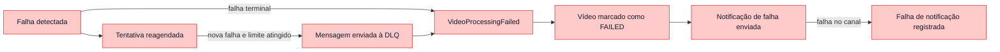
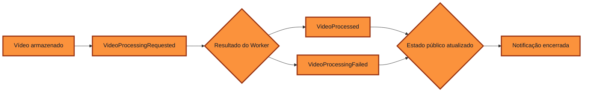
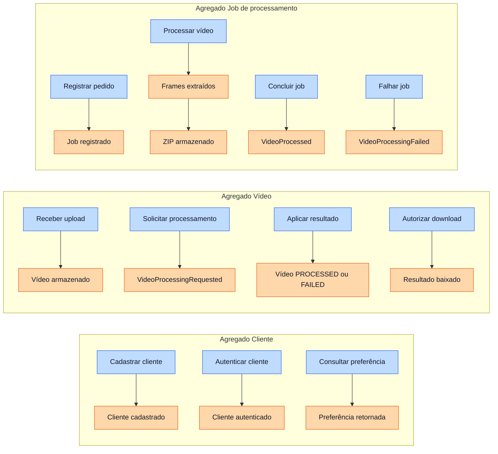
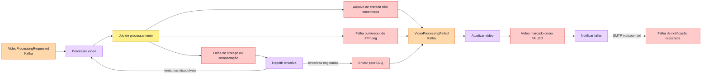

```mermaid
flowchart LR
    USER["Usuário"]

    C1["Cadastrar cliente"]
    A1["Cliente"]
    E1["Cliente cadastrado"]

    C2["Autenticar"]
    E2["Cliente autenticado"]

    C3["Enviar vídeo"]
    A2["Vídeo"]
    E3["Vídeo armazenado"]
    P1["Solicitar processamento"]
    E4["VideoProcessingRequested<br/>Kafka"]

    X1["Kafka<br/>solicitações"]
    P2["Iniciar processamento"]
    A3["Job de processamento"]
    E5["Processamento iniciado"]
    E6["Frames extraídos"]
    E7["ZIP armazenado"]
    E8["VideoProcessed<br/>Kafka"]

    X3["Kafka<br/>resultados"]
    P3["Atualizar resultado"]
    E9["Vídeo processado"]
    P4["Notificar cliente"]
    X2["Gmail"]
    E10["Notificação enviada"]

    C4["Baixar resultado"]
    E11["Resultado baixado"]

    USER --> C1 --> A1 --> E1
    USER --> C2 --> A1 --> E2
    USER --> C3 --> A2 --> E3
    E3 --> P1 --> E4 --> X1
    X1 --> P2 --> A3 --> E5 --> E6 --> E7 --> E8
    E8 --> X3 --> P3 --> A2 --> E9
    E9 --> P4 --> X2 --> E10
    USER --> C4 --> A2 --> E11

    classDef actor fill:#e5e7eb,stroke:#4b5563,color:#111827;
    classDef command fill:#bfdbfe,stroke:#2563eb,color:#111827;
    classDef aggregate fill:#fef08a,stroke:#ca8a04,color:#111827;
    classDef event fill:#fed7aa,stroke:#ea580c,color:#111827;
    classDef policy fill:#e9d5ff,stroke:#9333ea,color:#111827;
    classDef external fill:#fbcfe8,stroke:#db2777,color:#111827;

    class USER actor;
    class C1,C2,C3,C4 command;
    class A1,A2,A3 aggregate;
    class E1,E2,E3,E4,E5,E6,E7,E8,E9,E10,E11 event;
    class P1,P2,P3,P4 policy;
    class X1,X2,X3 external;
```

# Event Storming — Processamento de vídeo

Este modelo separa comandos, agregados, eventos de domínio, políticas e
sistemas externos. Os eventos marcados como Kafka correspondem aos contratos de
integração implementados; os demais representam fatos internos do domínio.

## Legenda

| Elemento | Cor | Significado |
| --- | --- | --- |
| Ator | Cinza | Pessoa que inicia uma ação. |
| Comando | Azul | Intenção enviada ao domínio. |
| Agregado | Amarelo | Componente que valida regras e mantém estado. |
| Evento | Laranja | Fato que já aconteceu. |
| Política | Roxo | Reação automática a um evento. |
| Sistema externo | Rosa | Dependência fora do domínio da aplicação. |
| Exceção | Vermelho | Resultado alternativo ou falha. |

## Etapa 1 — Descoberta caótica dos eventos

Nesta etapa os participantes registram fatos relevantes no passado sem tentar
ordená-los ou agrupá-los. A posição dos eventos nesta tabela é
intencionalmente aleatória.

| Evento descoberto | Evento descoberto | Evento descoberto | Evento descoberto |
| --- | --- | --- | --- |
| Vídeo processado | Cliente cadastrado | ZIP gerado | Notificação falhou |
| Frames extraídos | Resultado baixado | Vídeo armazenado | Processamento iniciado |
| Cliente autenticado | Solicitação publicada | Arquivo de entrada não encontrado | Preferência de notificação consultada |
| Job registrado | Vídeo marcado como falha | Upload recebido | Notificação enviada |
| Resultado armazenado | Tentativa reagendada | Evento duplicado ignorado | Processamento falhou |

O objetivo é ampliar a descoberta. Repetições e nomes diferentes para o mesmo
fato são resolvidos somente na etapa seguinte.

## Etapa 2 — Eventos organizados em ordem

Depois da descoberta, os eventos são normalizados e colocados na linha do tempo
do fluxo principal.

```mermaid
flowchart LR
    E1["Cliente cadastrado"] --> E2["Cliente autenticado"]
    E2 --> E3["Upload recebido"]
    E3 --> E4["Vídeo armazenado"]
    E4 --> E5["Solicitação registrada"]
    E5 --> E6["VideoProcessingRequested"]
    E6 --> E7["Job registrado"]
    E7 --> E8["Processamento iniciado"]
    E8 --> E9["Frames extraídos"]
    E9 --> E10["ZIP gerado"]
    E10 --> E11["Resultado armazenado"]
    E11 --> E12["VideoProcessed"]
    E12 --> E13["Vídeo marcado como PROCESSED"]
    E13 --> E14["Preferência consultada"]
    E14 --> E15["Notificação enviada"]
    E15 --> E16["Resultado baixado"]

    classDef event fill:#fed7aa,stroke:#ea580c,color:#111827;
    class E1,E2,E3,E4,E5,E6,E7,E8,E9,E10,E11,E12,E13,E14,E15,E16 event;
```

O fluxo alternativo começa durante o processamento:

## Etapa 3 — Eventos pivotais

Eventos pivotais delimitam fases relevantes, mudam a responsabilidade pelo
fluxo ou abrem caminhos alternativos.

| Evento pivotal | Por que divide o fluxo | Próxima fase |
| --- | --- | --- |
| Vídeo armazenado | Confirma que o binário de entrada está durável. | Solicitação assíncrona |
| `VideoProcessingRequested` | Transfere a execução do Manager para o Worker. | Processamento técnico |
| `VideoProcessed` | Encerra o Worker com resultado disponível. | Atualização e notificação |
| `VideoProcessingFailed` | Abre o caminho terminal de falha. | Atualização e notificação de erro |
| Vídeo marcado como `PROCESSED` ou `FAILED` | Torna o estado final visível ao cliente. | Comunicação |
| Notificação enviada ou falha registrada | Encerra a tentativa automática de comunicação. | Consulta ou download pelo cliente |

## Etapa 4 — Agregados

Os eventos são agrupados pelas unidades que protegem invariantes e controlam
transições.

| Agregado | Responsabilidade | Invariantes principais |
| --- | --- | --- |
| Cliente | Cadastro, credenciais e preferência de notificação. | E-mail único, senha válida e canal de notificação consistente. |
| Vídeo | Propriedade, objetos e estado público do processamento. | Somente o proprietário consulta; download apenas em `PROCESSED`; estados terminais não reabrem. |
| Job de processamento | Tentativas, etapas técnicas, falha e resultado do Worker. | Um job por vídeo/evento; transições ordenadas; `COMPLETED` e `FAILED` são terminais. |

## Etapa 5 — Modelo enriquecido

Com a linha do tempo, os pivôs e agregados definidos, são adicionados atores,
comandos, políticas e sistemas externos.

### Fluxo principal

### Fluxos de exceção

### Políticas

| Quando | Então |
| --- | --- |
| Vídeo armazenado | Persistir e publicar a solicitação de processamento. |
| Solicitação recebida | Registrar o job de forma idempotente e iniciar o Worker. |
| Falha transitória | Repetir até o limite configurado. |
| Processamento concluído | Publicar `VideoProcessed`. |
| Falha terminal | Publicar `VideoProcessingFailed`. |
| Resultado recebido | Atualizar o vídeo de forma idempotente. |
| Estado final confirmado | Consultar a preferência e notificar o cliente. |
| Notificação falhar | Registrar a falha sem reverter o processamento concluído. |

## Eventos de integração implementados

| Evento | Tópico | Produtor | Consumidor |
| --- | --- | --- | --- |
| `VideoProcessingRequested` | `video.processing.requested` | Video Manager | Video Worker |
| `VideoProcessed` | `video.processing.completed` | Video Worker | Video Manager |
| `VideoProcessingFailed` | `video.processing.failed` | Video Worker | Video Manager |
