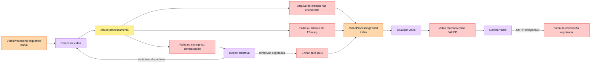

# Event Storming — Processamento de vídeo

Este modelo separa comandos, agregados, eventos de domínio, políticas e
sistemas externos. Os eventos marcados como Kafka correspondem aos contratos de
integração implementados; os demais representam fatos internos do domínio.

## Legenda

| Elemento | Cor | Significado |
| --- | --- | --- |
| Ator | Cinza | Pessoa que inicia uma ação. |
| Comando | Azul | Intenção enviada ao domínio. |
| Agregado | Amarelo | Componente que valida regras e mantém estado. |
| Evento | Laranja | Fato que já aconteceu. |
| Política | Roxo | Reação automática a um evento. |
| Sistema externo | Rosa | Dependência fora do domínio da aplicação. |
| Exceção | Vermelho | Resultado alternativo ou falha. |

## Fluxo principal

```mermaid
flowchart LR
    USER["Usuário"]

    C1["Cadastrar cliente"]
    A1["Cliente"]
    E1["Cliente cadastrado"]

    C2["Autenticar"]
    E2["Cliente autenticado"]

    C3["Enviar vídeo"]
    A2["Vídeo"]
    E3["Vídeo armazenado"]
    P1["Solicitar processamento"]
    E4["VideoProcessingRequested<br/>Kafka"]

    X1["Kafka<br/>solicitações"]
    P2["Iniciar processamento"]
    A3["Job de processamento"]
    E5["Processamento iniciado"]
    E6["Frames extraídos"]
    E7["ZIP armazenado"]
    E8["VideoProcessed<br/>Kafka"]

    X3["Kafka<br/>resultados"]
    P3["Atualizar resultado"]
    E9["Vídeo processado"]
    P4["Notificar cliente"]
    X2["Gmail"]
    E10["Notificação enviada"]

    C4["Baixar resultado"]
    E11["Resultado baixado"]

    USER --> C1 --> A1 --> E1
    USER --> C2 --> A1 --> E2
    USER --> C3 --> A2 --> E3
    E3 --> P1 --> E4 --> X1
    X1 --> P2 --> A3 --> E5 --> E6 --> E7 --> E8
    E8 --> X3 --> P3 --> A2 --> E9
    E9 --> P4 --> X2 --> E10
    USER --> C4 --> A2 --> E11

    classDef actor fill:#e5e7eb,stroke:#4b5563,color:#111827;
    classDef command fill:#bfdbfe,stroke:#2563eb,color:#111827;
    classDef aggregate fill:#fef08a,stroke:#ca8a04,color:#111827;
    classDef event fill:#fed7aa,stroke:#ea580c,color:#111827;
    classDef policy fill:#e9d5ff,stroke:#9333ea,color:#111827;
    classDef external fill:#fbcfe8,stroke:#db2777,color:#111827;

    class USER actor;
    class C1,C2,C3,C4 command;
    class A1,A2,A3 aggregate;
    class E1,E2,E3,E4,E5,E6,E7,E8,E9,E10,E11 event;
    class P1,P2,P3,P4 policy;
    class X1,X2,X3 external;
```

## Fluxos de exceção

## Elementos do domínio

### Agregados

| Agregado | Responsabilidade |
| --- | --- |
| Cliente | Cadastro, credenciais e preferência de notificação. |
| Vídeo | Propriedade, localização dos objetos e estado público do processamento. |
| Job de processamento | Tentativas, etapas técnicas, falha e resultado do Worker. |

### Políticas

| Quando | Então |
| --- | --- |
| Vídeo armazenado | Persistir e publicar a solicitação de processamento. |
| Solicitação recebida | Registrar o job de forma idempotente e iniciar o Worker. |
| Falha transitória | Repetir até o limite configurado. |
| Processamento concluído | Publicar `VideoProcessed`. |
| Falha terminal | Publicar `VideoProcessingFailed`. |
| Resultado recebido | Atualizar o vídeo de forma idempotente. |
| Estado final confirmado | Consultar a preferência e notificar o cliente. |
| Notificação falhar | Registrar a falha sem reverter o processamento concluído. |

## Eventos de integração implementados

| Evento | Tópico | Produtor | Consumidor |
| --- | --- | --- | --- |
| `VideoProcessingRequested` | `video.processing.requested` | Video Manager | Video Worker |
| `VideoProcessed` | `video.processing.completed` | Video Worker | Video Manager |
| `VideoProcessingFailed` | `video.processing.failed` | Video Worker | Video Manager |
