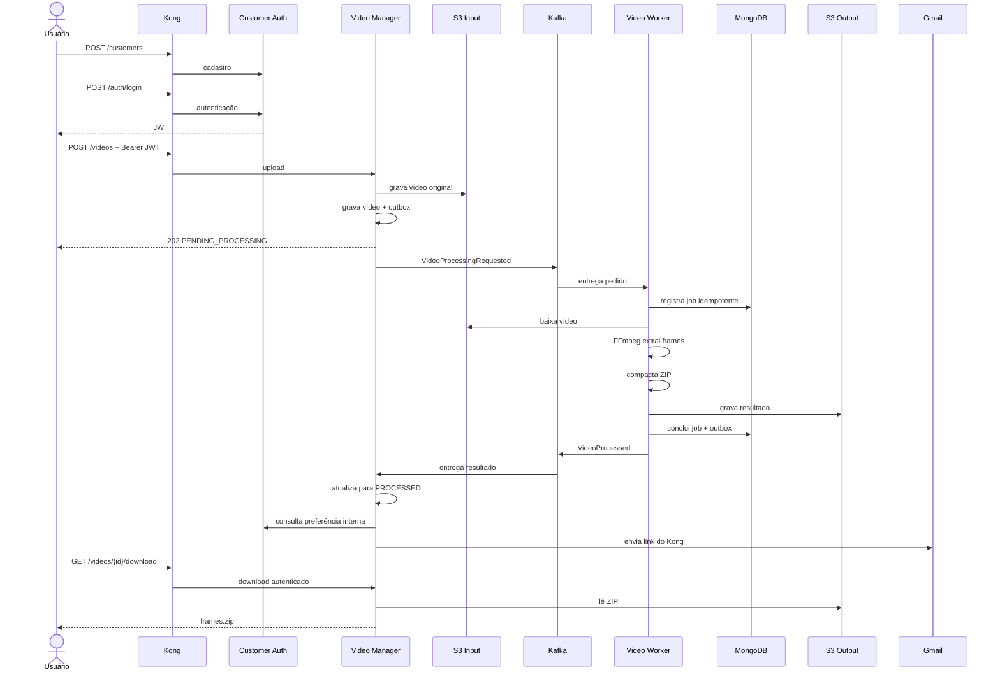
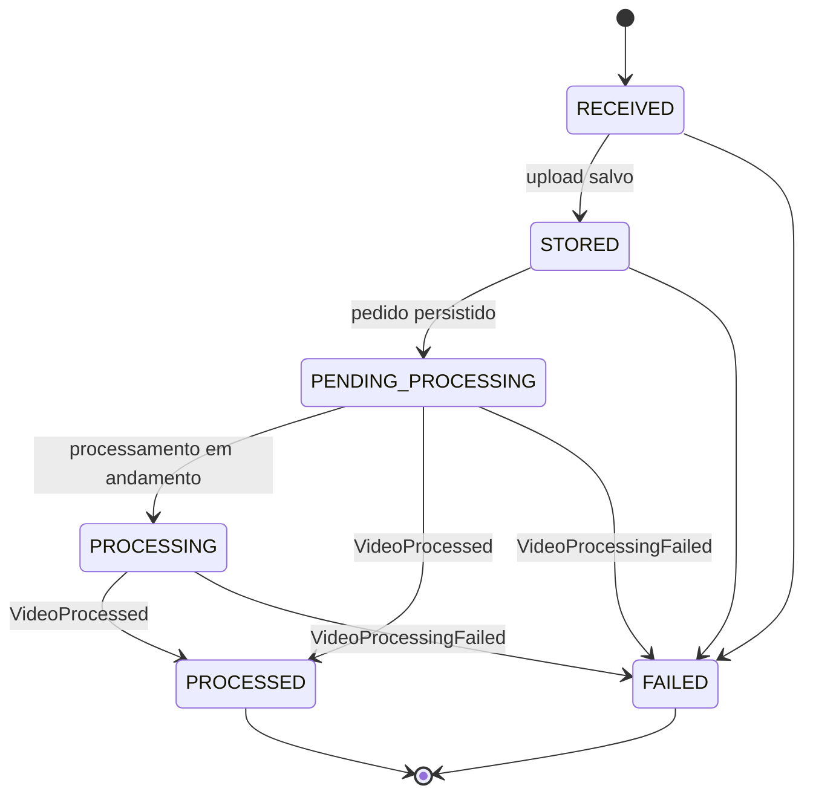
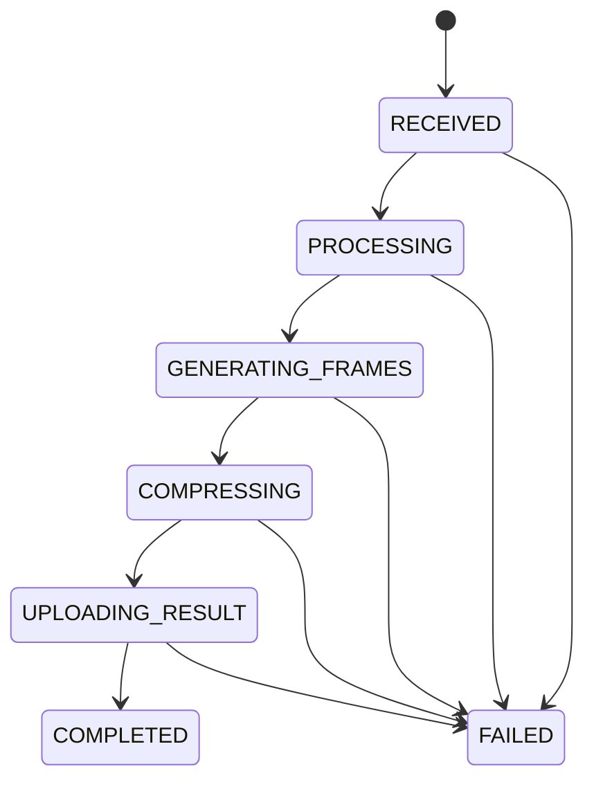

# Fluxo de processamento

## Sequência principal

Em uma falha terminal, o Worker publica `VideoProcessingFailed`; o Manager muda
o vídeo para `FAILED` e envia a notificação de falha sem disponibilizar ZIP.

## Estado público do vídeo

O estado `PROCESSING` existe no domínio, mas o contrato atual do Worker não
publica um evento de início. Por isso, no fluxo implementado, o resultado pode
levar o vídeo diretamente de `PENDING_PROCESSING` para `PROCESSED`.

## Estado interno do Worker

