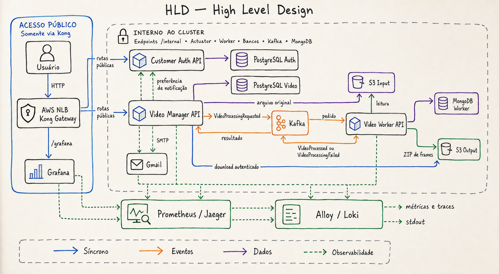

# HLD — High Level Design

## Responsabilidades

- O Kong é a única entrada pública e encaminha tráfego para Services
  Kubernetes, nunca diretamente para IPs de pods.
- O Customer Auth mantém clientes e emite JWT HS256.
- O Manager é a API de negócio e a fonte de verdade do estado público do vídeo.
- O Worker executa o processamento assíncrono e não possui endpoint público.
- Kafka desacopla upload e processamento.
- S3 guarda o vídeo original e o ZIP resultante.
- PostgreSQL mantém dados transacionais; MongoDB mantém os jobs do Worker.
- Grafana consulta Prometheus, Loki e Jaeger.

## Limites de acesso

O Kong publica somente cadastro, login, consulta do próprio cliente, operações
de vídeo e Grafana. Endpoints `/internal`, Actuator, Worker, bancos, Kafka e
MongoDB permanecem internos ao cluster.
