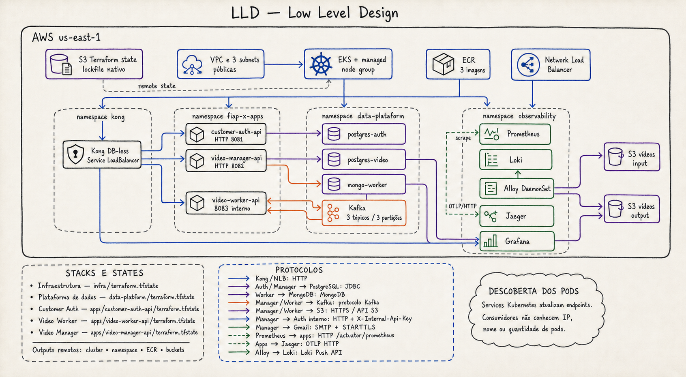

# LLD — Low Level Design

## Stacks e states

| Stack | State |
| --- | --- |
| Infraestrutura | `infra/terraform.tfstate` |
| Plataforma de dados | `data-platform/terraform.tfstate` |
| Customer Auth | `apps/customer-auth-api/terraform.tfstate` |
| Video Worker | `apps/video-worker-api/terraform.tfstate` |
| Video Manager | `apps/video-manager-api/terraform.tfstate` |

As stacks dependentes leem os outputs remotos de infraestrutura e dados para
descobrir cluster, namespace, ECR e buckets. Isso elimina cópia manual desses
endereços.

## Protocolos

| Origem | Destino | Protocolo |
| --- | --- | --- |
| Usuário | Kong/NLB | HTTP |
| Kong | Auth, Manager e Grafana | HTTP via DNS de Service Kubernetes |
| Auth/Manager | PostgreSQL | JDBC |
| Worker | MongoDB | MongoDB |
| Manager/Worker | Kafka | protocolo Kafka |
| Manager/Worker | S3 | HTTPS / API compatível com S3 |
| Manager | Auth interno | HTTP + `X-Internal-Api-Key` |
| Manager | Gmail | SMTP com STARTTLS |
| Prometheus | aplicações | HTTP `/actuator/prometheus` |
| Aplicações | Jaeger | OTLP HTTP |
| Alloy | Loki | Loki Push API |

## Descoberta dos pods

Kong, aplicações e componentes de dados usam nomes de Services Kubernetes.
Quando um pod é substituído, o controlador do Service atualiza seus endpoints.
O consumidor não precisa conhecer IP, nome ou quantidade de pods.
