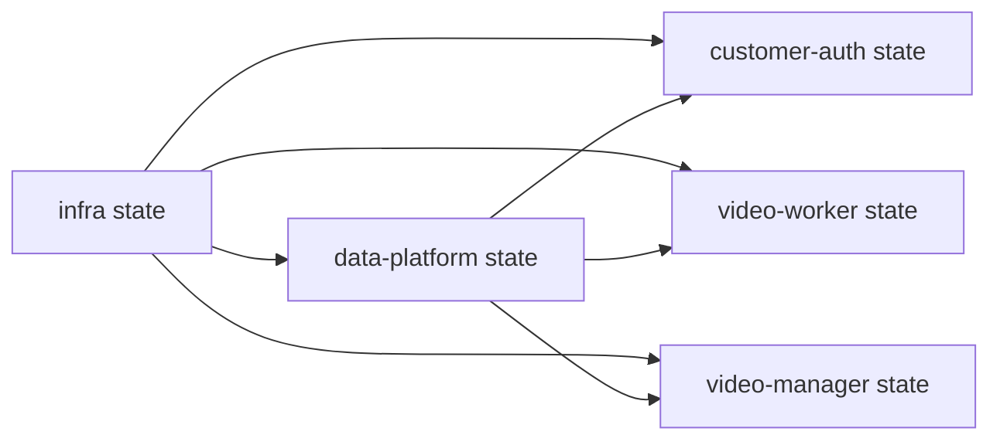

# Terraform state centralizado

## Backend

O backend usa um bucket S3 por conta e região:

```text
fiap-hackathon-tfstate-<AWS_ACCOUNT_ID>-<AWS_REGION>
```

Configuração comum:

```hcl
backend "s3" {
  region       = "us-east-1"
  encrypt      = true
  use_lockfile = true
}
```

`use_lockfile = true` usa o lock nativo no S3. Não existe tabela DynamoDB para
locking nesta implementação.

## Dependências



- Data Platform lê cluster e credenciais de conexão Kubernetes do state da
  Infra.
- As aplicações leem cluster, ECR e namespace da Infra.
- As aplicações leem namespace e buckets da Data Platform.
- O Manager também consulta o Service do Kong para montar
  `PUBLIC_API_BASE_URL`.

## Operação do lock

Se uma execução for interrompida, primeiro confirme que nenhuma pipeline ainda
está usando o mesmo state. Somente depois remova o lock com o ID informado pelo
Terraform:

```bash
terraform force-unlock <LOCK_ID>
```

Não use `-lock=false` em pipelines, pois isso permite escrita concorrente no
mesmo state.
